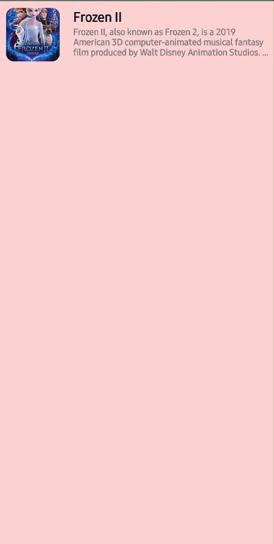

<h1 align="center">Orbital</h1></br>

<p align="center">
    <a href="https://devlibrary.withgoogle.com/products/android/repos/skydoves-Orbitary"></a><br>
  <a href="https://opensource.org/licenses/Apache-2.0"></a>
  <a href="https://android-arsenal.com/api?level=21"></a>
  <a href="https://github.com/skydoves/Orbital/actions/workflows/android.yml"></a>
  <a href="https://androidweekly.net/issues/issue-525"></a>
  <a href="https://us12.campaign-archive.com/?u=f39692e245b94f7fb693b6d82&id=68710ad80a"></a>
  <a href="https://github.com/skydoves"></a>
</p><br>

<p align="center">
🪐 Jetpack Compose animation library that allows you to implement animations such as shared element transition. This library support Kotlin Multiplatform (Android, iOS, Desktop, macOS, and js)
</p><br>

<p align="center">


</p>

<p align="center">


</p>

## Download
[](https://search.maven.org/search?q=g:%22com.github.skydoves%22%20AND%20a:%22orbital%22)

### Gradle

Add the dependency below to your **module**'s `build.gradle` file:

```gradle
dependencies {
    implementation("com.github.skydoves:orbital:0.4.0")
}
```

> **Note**: This is an experimental library that demonstrates various animations with Jetpack Compose. Please make sure that your project uses Jetpack Compose `1.5.4`, Compose Compiler `1.5.4`, and Kotlin `1.9.20`.

For Kotlin Multiplatform, add the dependency below to your **module**'s `build.gradle.kts` file:

```gradle
sourceSets {
    val commonMain by getting {
        dependencies {
            implementation("com.github.skydoves:orbital:$version")
        }
    }
}
```

## Usage

You can implement three kinds of animations with Orbital: **Movement**, **Transformation**, and **Shared Element Transition**. 
Basically, you can run animation with `Orbital` Composable function, which provides `OrbitalScope` that allows you to create animations.

### Transformation


The example below shows how to implement resizing animation with the `animateTransformation` extension of the `OrbitalScope`.
The `rememberContentWithOrbitalScope` allows you to create custom animations such as `animateTransformation` on the `OrbitalScope`.
You can apply the `animateTransformation` animation to specific Composables and customize its `AnimationSpec` as seen the below:

```kotlin
  val transformationSpec = SpringSpec<IntSize>(
    dampingRatio = Spring.DampingRatioMediumBouncy,
    stiffness = 200f
  )

  var isTransformed by rememberSaveable { mutableStateOf(false) }
  val poster = rememberContentWithOrbitalScope {
    GlideImage(
      modifier = if (isTransformed) {
        Modifier.size(300.dp, 620.dp)
      } else {
        Modifier.size(100.dp, 220.dp)
      }.animateTransformation(this, transformationSpec),
      imageModel = ItemUtils.urls[0],
      contentScale = ContentScale.Fit
    )
  }

  Orbital(
    modifier = Modifier
      .clickable { isTransformed = !isTransformed }
  ) {
    Column(
      Modifier.fillMaxSize(),
      horizontalAlignment = Alignment.CenterHorizontally,
      verticalArrangement = Arrangement.Center
    ) {
      poster()
    }
  }
```

### Movement


The example below shows how to implement movement animation with the `animateMovement` extension of the `OrbitalScope`.
The `rememberContentWithOrbitalScope` allows you to create custom animations such as `animateMovement` on the `OrbitalScope`.
You can apply the `animateMovement` animation to specific Composables and customize its `AnimationSpec` as seen the below:

```kotlin
  val movementSpec = SpringSpec<IntOffset>(
    dampingRatio = Spring.DampingRatioMediumBouncy,
    stiffness = 200f
  )
  
  var isTransformed by rememberSaveable { mutableStateOf(false) }
  val poster = rememberContentWithOrbitalScope {
    GlideImage(
      modifier = if (isTransformed) {
        Modifier.size(360.dp, 620.dp)
      } else {
        Modifier.size(130.dp, 220.dp)
      }.animateMovement(this, movementSpec),
      imageModel = ItemUtils.urls[3],
      contentScale = ContentScale.Fit
    )
  }

  Orbital(
    modifier = Modifier
      .clickable { isTransformed = !isTransformed }
  ) {
    if (isTransformed) {
      Column(
        Modifier.fillMaxSize(),
        horizontalAlignment = Alignment.CenterHorizontally,
        verticalArrangement = Arrangement.Center
      ) {
        poster()
      }
    } else {
      Column(
        Modifier
          .fillMaxSize()
          .padding(20.dp),
        horizontalAlignment = Alignment.End,
        verticalArrangement = Arrangement.Bottom
      ) {
        poster()
      }
    }
  }
```

### Shared Element Transition


The example below shows how to implement shared element transition with the `animateSharedElementTransition` extension of the `OrbitalScope`.
The `rememberContentWithOrbitalScope` allows you to create custom animations such as `animateSharedElementTransition` on the `OrbitalScope`.
You can apply the `animateSharedElementTransition` animation to specific Composables and customize its `AnimationSpec`.
Also, you can set the different `AnimationSpec`s for the movement and transformation as seen the below:

```kotlin
@Composable
private fun OrbitalSharedElementTransitionExample() {
  var isTransformed by rememberSaveable { mutableStateOf(false) }
  val item = MockUtils.getMockPosters()[3]
  val poster = rememberContentWithOrbitalScope {
    GlideImage(
      modifier = if (isTransformed) {
        Modifier.fillMaxSize()
      } else {
        Modifier.size(130.dp, 220.dp)
      }.animateSharedElementTransition(
        this,
        SpringSpec(stiffness = 500f),
        SpringSpec(stiffness = 500f)
      ),
      imageModel = item.poster,
      contentScale = ContentScale.Fit
    )
  }

  Orbital(
    modifier = Modifier
      .clickable { isTransformed = !isTransformed }
  ) {
    if (isTransformed) {
      PosterDetails(
        poster = item,
        sharedElementContent = { poster() },
        pressOnBack = {}
      )
    } else {
      Column(
        Modifier
          .fillMaxSize()
          .padding(20.dp),
        horizontalAlignment = Alignment.End,
        verticalArrangement = Arrangement.Bottom
      ) {
        poster()
      }
    }
  }
}
```

> **Note**: LookaheadLayout is a very experimental API, so measuring complex Composables might throw exceptions.

### Shared Element Transition with Multiple Items

The example below shows how to implement shared element transition with multipe items. The basic concept of the usage is the same as the **Shared Element Transition** example.


```kotlin
  var isTransformed by rememberSaveable { mutableStateOf(false) }
  val items = rememberContentWithOrbitalScope {
    ItemUtils.urls.forEach { url ->
      GlideImage(
        modifier = if (isTransformed) {
          Modifier.size(140.dp, 180.dp)
        } else {
          Modifier.size(100.dp, 220.dp)
        }
          .animateSharedElementTransition(movementSpec, transformationSpec)
          .padding(8.dp),
        imageModel = url,
        contentScale = ContentScale.Fit
      )
    }
  }

  Orbital(
    modifier = Modifier
      .fillMaxSize()
      .clickable { isTransformed = !isTransformed },
    isTransformed = isTransformed,
    onStartContent = {
      Column(
        Modifier.fillMaxSize(),
        horizontalAlignment = Alignment.CenterHorizontally,
        verticalArrangement = Arrangement.Center
      ) {
        items()
      }
    },
    onTransformedContent = {
      Row(
        verticalAlignment = Alignment.CenterVertically
      ) { items() }
    }
  )
```

### Shared Element Transition With LazyList


The provided code example illustrates the implementation of shared element transformation (container transform) with a lazy list, such as `LazyColumn` and `LazyRow`. The `OrbitalScope` function initiates a scope in which all layout scopes will be measured and pre-calculated for size and position across all child layouts.   

```kotlin
@Composable
fun OrbitalLazyColumnSample() {
  val mocks = MockUtils.getMockPosters()

  Orbital {
    LazyColumn {
      items(mocks, key = { it.name }) { poster ->
        var expanded by rememberSaveable { mutableStateOf(false) }
        AnimatedVisibility(
          remember { MutableTransitionState(false) }
            .apply { targetState = true },
          enter = fadeIn(),
        ) {
          Orbital(modifier = Modifier
            .fillMaxWidth()
            .clickable {
              expanded = !expanded
            }
            .background(color = poster.color, shape = RoundedCornerShape(10.dp))) {
            val title = rememberMovableContentOf {
              Column(
                modifier = Modifier
                  .padding(10.dp)
                  .animateBounds(Modifier),
              ) {
                Text(
                  text = poster.name,
                  fontSize = 18.sp,
                  color = Color.Black,
                  fontWeight = FontWeight.Bold,
                )

                Text(
                  text = poster.description,
                  color = Color.Gray,
                  fontSize = 12.sp,
                  maxLines = 3,
                  overflow = TextOverflow.Ellipsis,
                  fontWeight = FontWeight.Bold,
                )
              }
            }
            val image = rememberMovableContentOf {
              GlideImage(
                imageModel = { poster.poster },
                component = rememberImageComponent {
                  +CrossfadePlugin()
                },
                modifier = Modifier
                  .padding(10.dp)
                  .animateBounds(
                    if (expanded) {
                      Modifier.fillMaxWidth()
                    } else {
                      Modifier.size(80.dp)
                    },
                    spring(stiffness = Spring.StiffnessLow),
                  )
                  .clip(RoundedCornerShape(5.dp)),
                imageOptions = ImageOptions(requestSize = IntSize(600, 600)),
              )
            }

            if (expanded) {
              Column {
                image()
                title()
              }
            } else {
              Row {
                image()
                title()
              }
            }
          }
        }
      }
    }
  }
}
```

You should bear in mind these three aspects:

- **Orbital**: The `Orbital` function starts a scope, which measures and pre-calculates the layout size and position for all child layouts. Fundamentally, it initiates a reusable Compose node for the given content, which makes all magic things under the hood. You can utilize the `Orbital` in nested ways based on your specific scenarios, as illustrated in the code above.
- **rememberMovableContentOf**: Utilize this function to remember a movable Composable function, allowing it to be relocated within the Compose tree. All items intended for transformation should be pre-defined using this function, enabling you to display different content based on various situations. All content defined using `rememberMovableContentOf` must be employed within the `Orbital`. 
- **animateBounds**: This serves as the delegate of the `Modifier` to compute distinct layout sizes based on various situations. It should be used in conjunction with the `rememberMovableContentOf` function.

### Transition Between Composables


You can implement transitions between composable functions, as you've learned in the previous functions. The sample code below demonstrates how you can implement a shared element transition between screens A and B by defining shared content:

```kotlin
enum class Screen {
  A, B;
}

@Composable
fun ScreenTransitionSample() {
  Orbital {
    var screen by rememberSaveable { mutableStateOf(Screen.A) }
    val sizeAnim = spring<IntSize>(stiffness = Spring.StiffnessLow)
    val positionAnim = spring<IntOffset>(stiffness = Spring.StiffnessLow)
    val image = rememberMovableContentOf {
      GlideImage(
        imageModel = { MockUtils.getMockPoster().poster },
        component = rememberImageComponent {
          +CrossfadePlugin()
        },
        modifier = Modifier
          .padding(10.dp)
          .animateBounds(
            modifier = if (screen == Screen.A) {
              Modifier.size(80.dp)
            } else {
              Modifier.fillMaxWidth()
            },
            sizeAnimationSpec = sizeAnim,
            positionAnimationSpec = positionAnim,
          )
          .clip(RoundedCornerShape(12.dp)),
        imageOptions = ImageOptions(requestSize = IntSize(600, 600)),
      )
    }

    val title = rememberMovableContentOf {
      Column(
        modifier = Modifier
          .padding(10.dp)
          .animateBounds(
            modifier = Modifier,
            sizeAnimationSpec = sizeAnim,
            positionAnimationSpec = positionAnim
          ),
      ) {
        Text(
          text = MockUtils.getMockPoster().name,
          fontSize = 18.sp,
          color = Color.Black,
          fontWeight = FontWeight.Bold,
        )

        Text(
          text = MockUtils.getMockPoster().description,
          color = Color.Gray,
          fontSize = 12.sp,
          maxLines = 3,
          overflow = TextOverflow.Ellipsis,
          fontWeight = FontWeight.Bold,
        )
      }
    }

    if (screen == Screen.A) {
      ScreenA(
        sharedContent = {
          image()
          title()
        }) {
        screen = Screen.B
      }
    } else {
      ScreenB(
        sharedContent = {
          image()
          title()
        }) {
        screen = Screen.A
      }
    }
  }
}

@Composable
private fun ScreenA(
  sharedContent: @Composable () -> Unit,
  navigateToScreenB: () -> Unit
) {
  Orbital {
    Row(modifier = Modifier
      .background(color = Color(0xFFffd7d7))
      .fillMaxSize()
      .clickable {
        navigateToScreenB.invoke()
      }) {
      sharedContent()
    }
  }
}

@Composable
private fun ScreenB(
  sharedContent: @Composable () -> Unit,
  navigateToScreenA: () -> Unit
) {
  Orbital {
    Column(modifier = Modifier
      .background(color = Color(0xFFe3ffd9))
      .fillMaxSize()
      .clickable {
        navigateToScreenA()
      }) {
      sharedContent()
    }
  }
}
```

Unfortunately, you can't achieve this transition with [Jetpack Compose Navigation](https://developer.android.com/jetpack/compose/navigation) yet.

## Find this repository useful? :heart:
Support it by joining __[stargazers](https://github.com/skydoves/Orbital/stargazers)__ for this repository. :star: <br>
Also, __[follow me](https://github.com/skydoves)__ on GitHub for my next creations! 🤩

# License
```xml
Designed and developed by 2022 skydoves (Jaewoong Eum)

Licensed under the Apache License, Version 2.0 (the "License");
you may not use this file except in compliance with the License.
You may obtain a copy of the License at

   http://www.apache.org/licenses/LICENSE-2.0

Unless required by applicable law or agreed to in writing, software
distributed under the License is distributed on an "AS IS" BASIS,
WITHOUT WARRANTIES OR CONDITIONS OF ANY KIND, either express or implied.
See the License for the specific language governing permissions and
limitations under the License.
```
